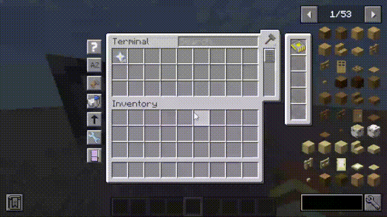

# AE2 Toggleable ViewCell

This mod is a simple addon for AE2 that adds toggleable View Cells.

## Texture License

The textures used in this mod are derived from resources available in
the [Applied Energistics 2 repository](https://github.com/AppliedEnergistics/Applied-Energistics-2/tree/forge/1.20.1), specifically from the
`forge/1.20.1` branch, and are licensed under [CC BY-NC-SA 3.0](https://creativecommons.org/licenses/by-nc-sa/3.0/).
